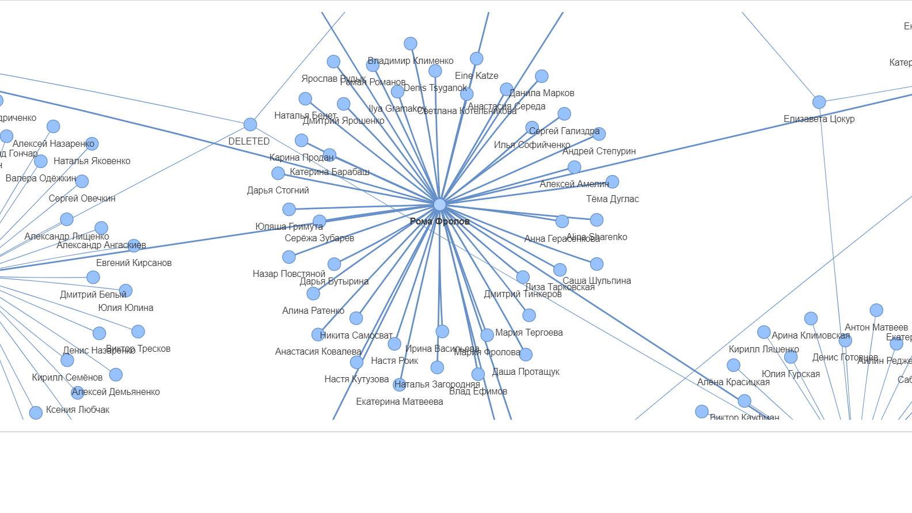

#### РАЗРАБОТКА ПРОГРАММЫ ПО ПОСТРОЕНИЮ ГРАФА НА ОСНОВЕ ДАННЫХ ИЗ СОЦИАЛЬНЫХ СЕТЕЙ
1) Импортируем необходимые библиотеки и используем кодировку UTF-8.

		# -*- coding: utf8 -*-
		import vk_api
		import networkx as nx
		from pyvis.network import Network
	
2) С помощью методов VK-API создадим функцию set_user_friend, которая на вход получает идентификатор пользователя, а на выход возвращает список, состоящий из множеств, определяющих начальную точку и конечную точку пути графа.

Модель возвращаемого массива имеет следующий вид:

	List((start_1, finish_1), (start_1,  finish_2), … , (start_1, finish_n))

Начальная точка (start), задается фамилией и именем пользователя, идентификатор которого был получен на вход. 

Конечная точка (finish), определяется множеством друзей пользователя (для корректной визуализации графа, используется ограничитель на множество друзей).

	def set_user_friend(user_id):
	    name_friend_list = []
	    node_user = session.method('users.get', {'user_ids': user_id})
	    node_user_name = node_user[0]['first_name'] + ' ' + node_user[0]['last_name']
	    friends_id = session.method('friends.get', {'user_id': user_id})
	    for friend in friends_id['items']:
		if len(name_friend_list) < 10:
		    friend_info = session.method('users.get', {'user_ids': friend})
		    one_friend_name = friend_info[0]['first_name'] + ' ' + friend_info[0]['last_name']
		    name_friend_list.append((node_user_name, one_friend_name))
	    return name_friend_list

3) Обращаемся к авторизированной страницы и записываем идентификаторы всех друзей, включая собственный.

		friends_id = session.method('friends.get', {'user_id': my_id})

		all_id_list = [my_id]
		for friend in friends_id['items']:
		    all_id_list.append(friend)
4) Создаем список, который будет заполнен кортежами для каждого пользователя (для списка создано ограничения, для корректной визуализации).
Перебираем идентификаторы из списка all_id_list, и с помощью функции set_user_friend, заполняем итоговый список.

		graf_set = []

		c = 1

		for id in all_id_list:
		    if len(graf_set) < 100:
			graf_set.extend(set_user_friend(id))
			print('Number of processed users:', c)
			c += 1
5) Записываем в переменную graf_madel пустую модель графа. Добавляем в неё вершины и ребра с помощью списка graf_set. Визуализируем модель графа.

		graf_model = nx.DiGraph()
		graf_model.add_edges_from(graf_set)

		net_model = Network()
		net_model.from_nx(graf_model)

		net_model.show('test_set.html', notebook=False)

6) Получаем следующий результат:

